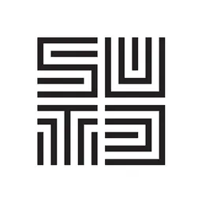

###### **Assistant Professor 助理教授**
###### School of Culture and Creativity 文化与创意学院
###### Beijing Normal-Hong Kong Baptist University 北师香港浸会大学
###### Research Areas: **Computer Graphics**, **Computational Design**, **VR/AR/MR**

   

Welcome to my website! I am currently an Assistant Professor at the School of Culture and Creativity, BNBU. My research lies at the <strong>unique intersection of computer graphics and physical art/design</strong>, where I develop computational tools for the automatic design of intriguing and functional, fabricable objects, such as puzzles, architectural structures, and furniture. My work has been published in top venues in computer graphics, including SIGGRAPH, TOG, and TVCG. My Ph.D. thesis was nominated to SUTD Best Ph.D. Thesis Award and I received SIGGRAPH 2022 Best Paper Honorable Mention Award. <strong style="color: red;">I am always open to collaborations with researchers from diverse backgrounds. If you’re interested or share similar research interests, feel free to drop me an email!</strong>

  
  

#### **News**

<table border="0" cellspacing="0" cellpadding="8">
  <tbody>
    <tr>
      <td>2025.8</td>
      <td>I will be joining BNBU this September as an Assistant Professor!</td>
    </tr>
    <tr>
      <td>2025.4</td>
      <td>One paper accepted by TVCG.</td>
    </tr>
    <tr>
      <td>2024.9</td>
      <td>Starting my Postdoc journey at SUTD.</td>
    </tr>
        <tr>
      <td>2024.7</td>
      <td>Pass my Ph.D. defense without correction!</td>
    </tr>
  </tbody>
</table>
   

#### **Short Bio**

Prior to joining BNBU, I was a postdoctoral researcher at the <a href="https://sutd-cgl.github.io/">Computer Graphics Laboratory</a>, Singapore University of Technology and Design, under the supervision of <a href="https://songpenghit.github.io/">Prof. Peng Song</a>, where I also received my doctoral degree in 2024. Prior to that, I earned my bachelor’s degree from Shantou University in 2020, supervised by <a href="https://eng.stu.edu.cn/info/1084/1866.htm">Prof. Chuliang Wei</a>. During 2019 to 2020, I was a research intern at CUHKSZ under the supervision of <a href="https://sites.google.com/site/sunkurt/home">Prof. Zhenglong Sun</a>.

  

#### **Work and Education Experience**

<table border="0" cellspacing="0" cellpadding="8">
  <tbody>
    <tr>
      <td>2025 - present</td>
      <td>Assistant Professor</td>
      <td>BNBU</td>
      <td></td>
    </tr>
    <tr>
      <td>2024 – 2025</td>
      <td>Postdoctoral Researcher</td>
      <td>SUTD</td>
      <td></td>
    </tr>
    <tr>
      <td>2020 – 2024</td>
      <td>Ph.D. in Computer Graphics</td>
      <td>SUTD</td>
      <td></td>
    </tr>
    <tr>
      <td>2019 – 2020</td>
      <td>Visiting Student</td>
      <td>CUHKSZ</td>
      <td></td>
    </tr>
    <tr>
      <td>2016 – 2020</td>
      <td>B.S. in Electrical Engineering</td>
      <td>Shantou University</td>
      <td></td>
    </tr>
  </tbody>
</table>
 
  

#### **Teaching Experience**

##### Semester-long Course at BNBU

<table border="0" cellspacing="0" cellpadding="8">
  <tbody>
    <tr>
      <td>MAD3103</td>
      <td>Game Design</td>
      <td>Instructor</td>
      <td>2025 - present</td>
    </tr>
    <tr>
      <td>AIM2053</td>
      <td>Programming Introduction</td>
      <td>Instructor</td>
      <td>2025 - present</td>
    </tr>
  </tbody>
</table>
  

##### Semester-long Course at SUTD

<table border="0" cellspacing="0" cellpadding="8">
  <tbody>
    <tr>
      <td>50.017</td>
      <td>Graphics and Visualisation</td>
      <td>Teaching Assistant</td>
      <td>2025 - present</td>
    </tr>
  </tbody>
</table>
  

##### Summer Program

<table border="0" cellspacing="0" cellpadding="8">
  <tbody>
    <tr>
      <td>MIT Summer Geometry Initiative</td>
      <td>Guest Lecturer</td>
      <td>2024 Fall</td>
    </tr>
    <tr>
      <td>SUTD-ZJU Summer Exchange Program</td>
      <td>Guest Lecturer</td>
      <td>2022 Fall</td>
    </tr>
  </tbody>
</table>
  

#### **Awards**

<table border="0" cellspacing="0" cellpadding="8">
  <tbody>
    <tr>
      <td>2024</td>
      <td>SUTD Best Ph.D. Thesis Nomination</td>
    </tr>
    <tr>
      <td>2022</td>
      <td>SIGGRAPH 2022 Best Paper Honorable Mention Award</td>
    </tr>
    <tr>
      <td>2020</td>
      <td>SUTD Ph.D. Fellowship</td>
    </tr>
  </tbody>
</table>
  

